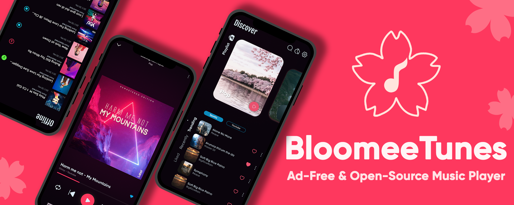
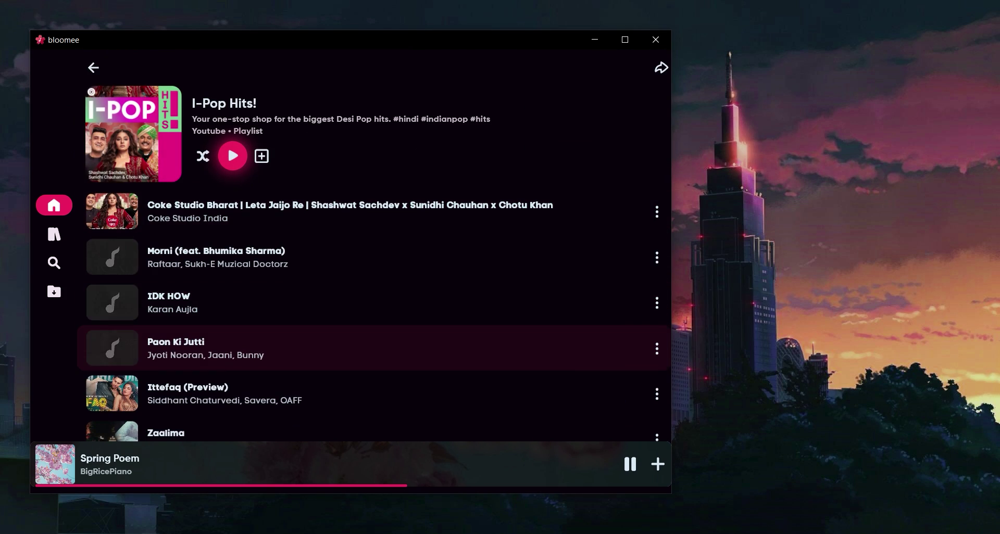

 
**<h1 align=center>Bloomee🌸</h1>**

    

 
Bloomee is my Flutter project, An Open Source Music app designed to bring you Ad-free tunes from various sources. Dive into a world of limitless music from platforms like YouTube and Jio Saavn, with more sources blooming soon! 🌼🎵

### **Why Bloomee?**

🌟 **Ad-Free Experience:** Say goodbye to interruptions and enjoy uninterrupted musical bliss.

🌍 **Multi-Source Player:** Access your favorite tracks from diverse platforms, with more sources continually joining our melody garden.

🚀 **Flutter-Powered Learning:** Bloomee is not just about music; it's about learning and growing with Flutter and BLoC architecture. Explore the intersection of beautiful design and smooth functionality while mastering the art of app development.

### **Features**
- [x] 🎵 Offline Music Experience
- [x] 🚫 Ad-Free Music
- [x] 📉 Minimal Data Usage
- [x] 💾 Space Efficient
- [x] 🏃 Lightweight App
- [x] 🎧 Personalized Playlist Creation and Sharing
- [x] 🔓 Open Source
- [x] ⏲️ Sleep Timer
- [x] 🌐 Daily Updated Global Charts
- [x] 🖥️ Support for Windows
- [ ] 🐧 Support for Linux
- [ ] 🍏 Support for iOS
- [ ] 📝 Lyrics Support
- [ ] 🎼 AI-Generated Playlist
- [ ] 💡 AI-Based Recommendations
- [ ] 🆎 Multi-Language support

 
<h3>Download for Android and Windows 😍</h3>

 

### **Contribute to BloomeeTunes! 🎶**

🌱 **Every Note Counts:** Your contribution, no matter how small, adds to the richness of Bloomee. Whether you're fixing a bug, enhancing features, or suggesting improvements, your notes in our melody matter. Also I'm new to flutter, So every contribution will help me and this project.

🚀 **Learn and Grow:** Contribute to Bloomee and enhance your Flutter and BLoC skills. Every pull request is an opportunity to learn, and we encourage contributors of all levels to join the journey.

**How to Contribute:**

1. **Fork the Repository:** Start your Bloomee journey by forking **dev(Branch)**.

2. **Clone Locally:** Clone the forked repository to your local machine.

3. **Create a Branch:** Create a new branch for your contribution.

4. **Make Changes:** Make your contribution - fix a bug, add a feature, or improve the documentation.

5. **Push Changes:** Push your changes to your forked repository.

6. **Create a Pull Request:** Submit a pull request, and let your notes join the Bloomee Symphony!

 

**Connect to me at:**

