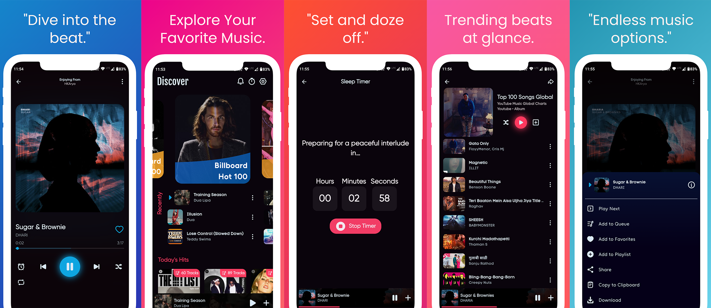
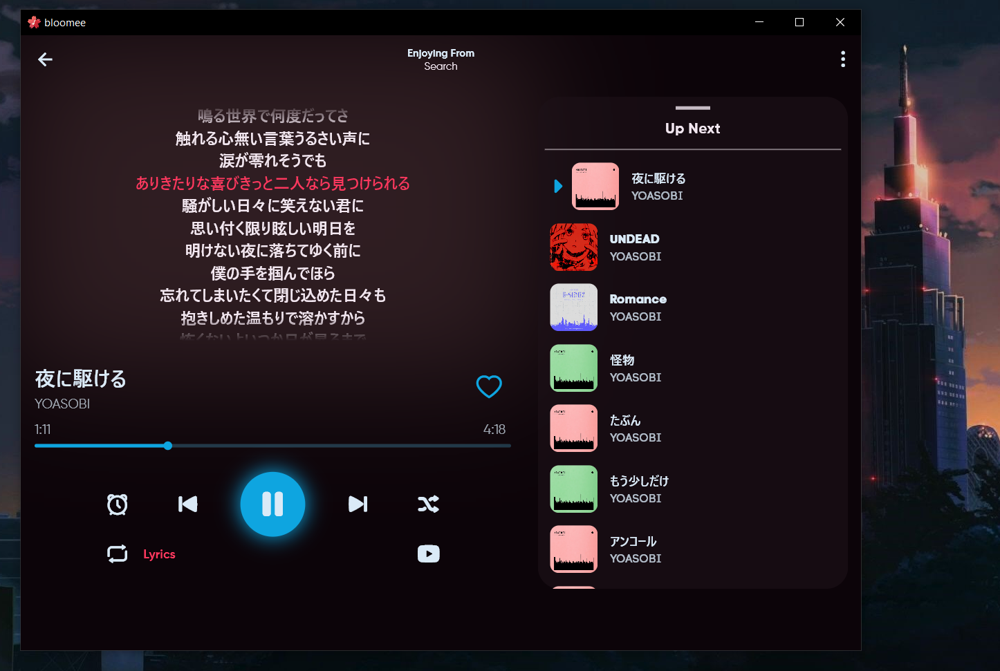

 
**<h1 align=center>Bloomee🌸</h1>**

 
     

    

Bloomee is experimental cross-platform open Source Music player designed to bring you Ad-free tunes from various sources. Dive into a world of limitless music from platforms like YouTube and Jio Saavn, with more sources blooming soon! 🌼🎵

### **Why Bloomee?**

🌟 **Ad-Free Experience:** Say goodbye to interruptions and enjoy uninterrupted musical bliss.

🌍 **Multi-Source Player:** Access your favorite tracks from diverse platforms, with more sources continually joining our melody garden.

🚀 **Flutter-Powered Learning:** Bloomee is not just about music; it's about learning and growing with Flutter and BLoC architecture. Explore the intersection of beautiful design and smooth functionality while mastering the art of app development.

### **Features**
- [x] 🚫 Ad-Free Music
- [x] 📝 Lyrics Support (Time Synced)
- [x] 📊 Scrobble music with Last.FM
- [x] 🎵 Offline Music Experience
- [x] 🔽 Import playlists from various source.
- [x] ⏲️ Sleep Timer
- [x] 🎧 Personalized Playlist Creation and Sharing
- [x] 🌐 Daily Updated Global Charts. (Billboard, Last.fm and more.)
- [x] 🖥️ Support for Android, Windows and Linux.
- [x] 📉 Minimal Data Usage
- [x] 💾 Space Efficient
- [x] 🏃 Lightweight App
- [x] 🔓 Open Source
- [x] 💿 Play Automatic Related Songs
- [x] 🎸 Share your playlists with others
- [ ] 🎼 AI-Generated Playlist
- [ ] 💡 AI-Based Recommendations
- [ ] 🆎 Multi-Language support

<h3 align=center>Download for Android, Windows & Linux(dev) 😍</h3>

 

<h3 align="center"> Now you can support me via</h3>

<a href="https://liberapay.com/hemantkarya/donate">

### **Contribute to BloomeeTunes! 🎶**

🌱 **Every Note Counts:** Your contribution, no matter how small, adds to the richness of Bloomee. Whether you're fixing a bug, enhancing features, or suggesting improvements, your notes in our melody matter. Also I'm new to flutter, So every contribution will help me and this project.

🚀 **Learn and Grow:** Contribute to Bloomee and enhance your Flutter and BLoC skills. Every pull request is an opportunity to learn, and we encourage contributors of all levels to join the journey.

To ensure a smooth and collaborative contribution process, we kindly ask that you first open an issue to discuss your ideas or proposed changes. This helps us align on the best approach and makes the review process more efficient. For detailed guidelines, please refer to our [CONTRIBUTING.md](CONTRIBUTING.md).

**How to Contribute:**

1. **Fork the Repository:** Start your Bloomee journey by forking **main(Branch)**.

2. **Clone Locally:** Clone the forked repository to your local machine.

3. **Create a Branch:** Create a new branch for your contribution.

4. **Make Changes:** Make your contribution - fix a bug, add a feature, or improve the documentation.

5. **Push Changes:** Push your changes to your forked repository.

6. **Create a Pull Request:** Submit a pull request, and let your notes join the Bloomee Symphony!

 

<h4 align=center>Get in touch with me at :-</h4>

 

