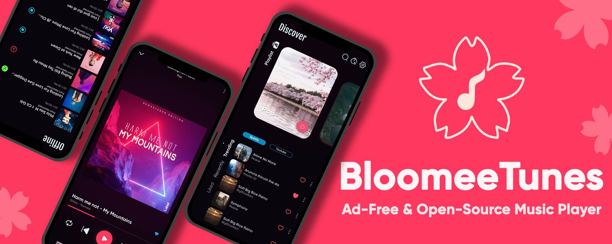
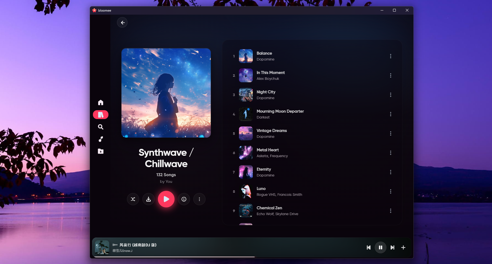
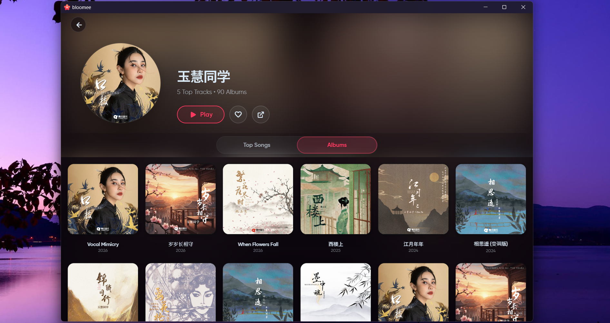
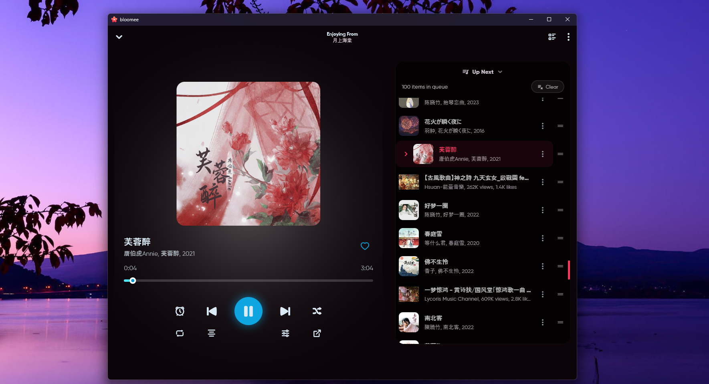
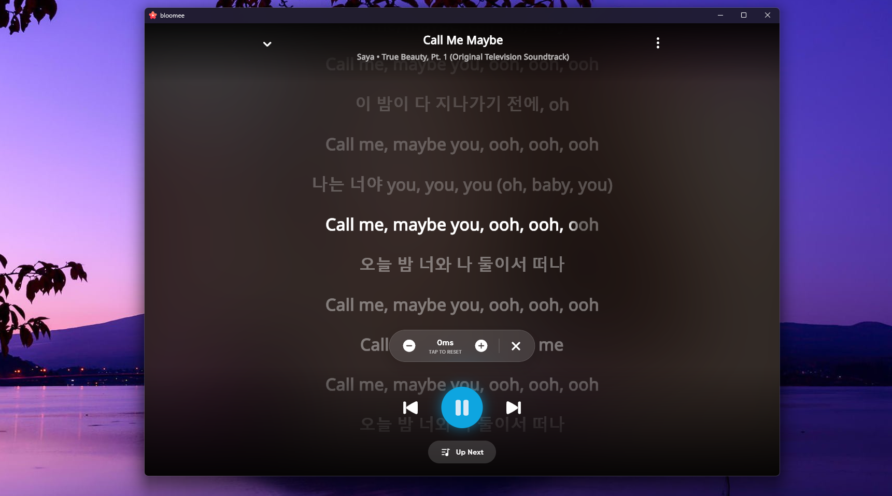
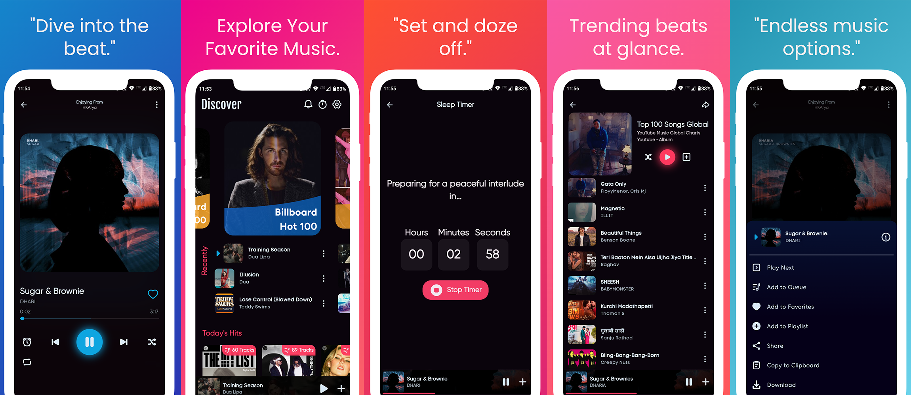

# 🌸 Bloomee 

**A unified local and plugin-first streaming music player built with Flutter & Rust.**

 
     

 **Bloomee** is an experimental, open-source music player designed to give you absolute freedom over your audio. Seamlessly mix your **local device music** with an infinite universe of streams powered by a secure, **Rust-backed plugin system**. No ads, no interruptions—just your tunes, your way. 🌼🎵

  

    
    
  

  

    
    

  

---
> ⚠️ **SECURITY WARNING: BEWARE OF FAKE WEBSITES!** ⚠️
> Due to the app's growing popularity, several unofficial websites have popped up claiming to be the "official" Bloomee site. **I do not have an official website for this app right now.** 
> 
> These impersonating sites are shady, completely unauthorized, and may distribute modified APKs containing viruses or malware. I am **not responsible** for any damage, privacy loss, or issues caused by downloading the app from these third-party sources. 
>
> **The ONLY official and safe places to download Bloomee are right here on GitHub, SourceForge, and IzzyOnDroid.** If an official website is ever launched, it will be announced directly in this README. Stay safe!
---

## 🚀 Features & Roadmap

- [x] 🚫 **Ad-Free Experience:** Zero interruptions, just pure music.
- [x] 🦀 **Plugins system:** Secure, auto-updating `.bex` plugin system for endless music sources.
- [x] 📂 **Local Music:** Play your local offline music seamlessly alongside online streams.
- [x] 🎤 **Karaoke-Style Lyrics:** Time-synced lyrics with manual offset adjustment.
- [x] 🎛️ **Audio Tweaks:** Built-in Equalizer and customizable Crossfade transitions.
- [x] 🔄 **Smart Replace:** Auto-recovery finds working streams if a playlist track goes dead.
- [x] 📊 **Last.fm Scrobbling:** Automatically log your listening history (includes offline caching).
- [x] 🎮 **Discord Rich Presence:** Show off your current tunes on your Discord profile.
- [x] 🌍 **Global Charts:** Daily updated charts from installed plugins.
- [x] 🖥️ **Cross-Platform:** Native media controls and shortcuts for Windows, Linux, and Android.
- [x] 💾 **Backup & Restore:** Easily export/import your library and settings via JSON or M3U.
- [x] 🤖 **AI-Based Recommendations:** Get smarter song suggestions (Last.fm/Plugin Based).
- [x] 🆎 **Multi-Language Support:** Localized app interface for global users *(Implementing more languages..)*

---
## 🌍 Language Support

| Language | Native Name | Status |
|----------|------------|--------|
| 🇮🇳 Hindi | हिन्दी | ✅ Complete |
| 🇺🇸 English | English | ✅ Complete |
| 🇰🇷 Korean | 한국어 | ✅ Complete |
| 🇩🇪 German | Deutsch | ✅ Complete |
| 🇪🇸 Spanish | Español | ✅ Complete |
| 🇯🇵 Japanese | 日本語 | ✅ Complete |

> 🟢 All translations are fully completed and maintained, Still if you feel any language needs more thought then please feel free to open the issue.
---

<h2 align="center">📥 Download & Install</h2>

<h4 align="center">Available for Android, Windows & Linux (Dev) 😍</h4>

  
  &nbsp;
  

  

---

## 💖 Support the Development

Bloomee is a passion project. I spend countless hours building, refining, and fixing bugs to give everyone a premium, ad-free music experience. If you love the app and want to see it grow, consider supporting my work! 

Every contribution, big or small, keeps the music playing. ☕🎶

  

   
  

---

## 🤝 Contribute to Bloomee

**Every note counts!** Whether you're a seasoned developer or a beginner (I am relatively new to Flutter myself!), your pull requests, bug reports, and feature suggestions are highly appreciated. 

Contributing to Bloomee is a great way to learn **Flutter, clean architecture, and BLoC patterns** in a real-world codebase.

1. **Discuss:** Open an Issue first to discuss your idea.
2. **Fork & Clone:** Fork the `main` branch.
3. **Branch & Build:** Create your feature branch.
4. **Pull Request:** Submit a PR and let your code join the Bloomee symphony!

*Please read our [CONTRIBUTING.md](CONTRIBUTING.md) for detailed guidelines.*

---

## 📫 Get in Touch

Have questions, feedback, or just want to say hi? Connect with me here:

<i>Made with ❤️</i>
